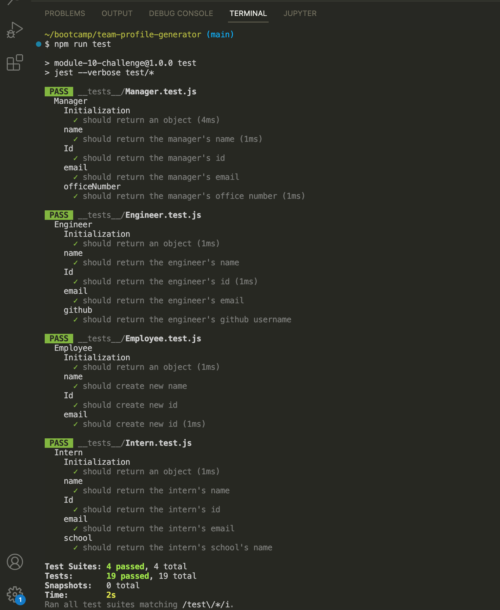
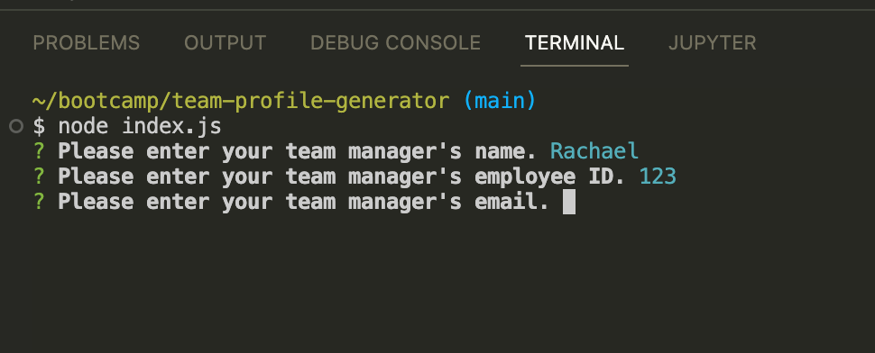
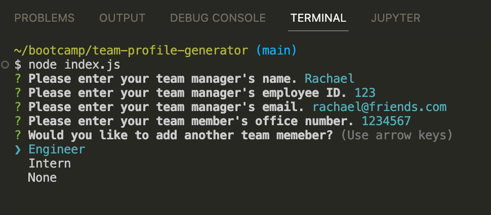
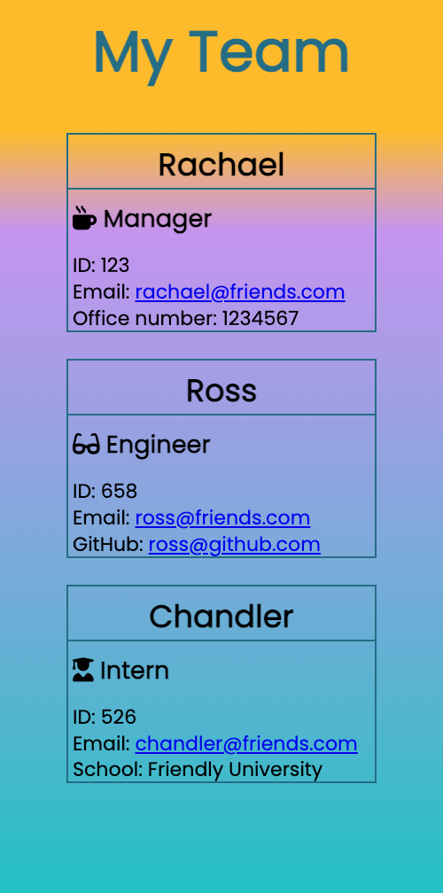
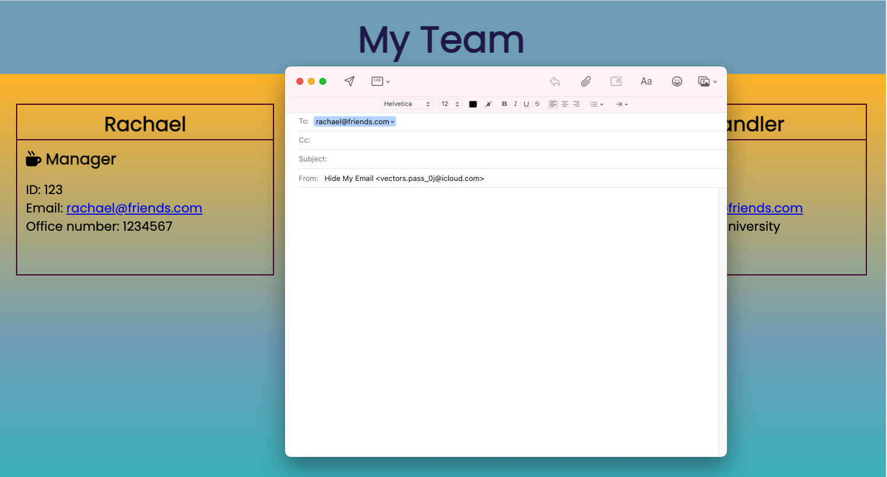

# Team Profile Generator

## Table of Contents
1. [Descriptions](#descriptions) 
2. [Testing](#testing)
3. [Usage](#usage)
4. [Contributing](#contributing)
5. [Link](#link)


## Descriptions
This app allows the user to create the list of the team members with the essentials information according to their roles. Because working as a team can get overwhelmed with the numbers of staff and the information related. By being able to have a quick access to the information needed will decrease the time factor and enable the team to focus on the next important tasks.


## Testing
It is important to make sure the app will run effectively. Jest is used to perform testing for this team generator app and Inquirer to collect the input from user. Developer will write the test based on functionality of the app, run the test until all the tests have passed.

To run the test use the following command.

```pip
$ npm run test
```



## Usage
The app is invoked by typing the command node index.js in the terminal.

```pip
$ node index.js
```
User will be prompted for the inputs relate to the employee's role.



User can add team members for different roles until satisfies with the team by selecting 'None' from the list.



The app will generate 'My Team' webpage displaying all the information collecting from the user's input.



The user will be able to have a quick and easy access to the basic information of each team members.



## Contributing
My instructor Mr.Anthony Cooper.

## Link 
You can click the following link for the walkthrough video of this Team Generator App.

[Walkthrough Video](https://drive.google.com/file/d/1cSjoy_nZcGN2dZtG6MKCTGHXvPEylzor/view?usp=sharing)


